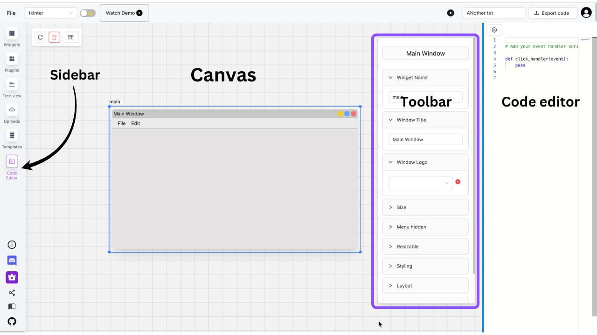
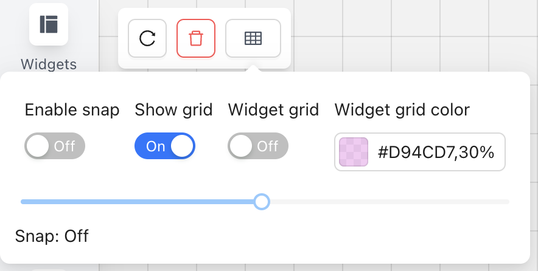

# PyUIBuilder Documentation

  
NOTE ⚠️

  This page is still under work in progress. This page will be updated from time to time. This contains the basic documentation for PYUIBuilder

## Resources

- [Getting started video](https://youtu.be/9dYv3VnchDA?si=kJoSXh0i-r1qm3AU)

- [Creating Calculator apps short/reel](https://youtube.com/shorts/1K2cM1gt13o?si=oxwNcoIpRU-8IkzS)

- [Youtube Tutorials Playlist](https://youtube.com/playlist?list=PL0VamwghCfX-KXtGKGLak-C_-Jcx_eOiK&si=1LagzyjBaifqDcND)

- [Create a signup form](https://medium.com/python-in-plain-english/create-tkinter-guis-using-tkinter-gui-builder-pyuibuilder-a7422489c55e)

- [Discord invite](https://discord.gg/dHXjrrCA7G)

- [basic pack Layout tutorial - Tkinter](https://www.youtube.com/watch?v=rbW1iJO1psk) 

## FAQs

### Common faqs
**1. Why does the design I created in tkinter look a bit off from my actual output**

Tkinter is OS dependent framework, and Pyuibuilder provides you with a common interface for you to develop. In the future we may consider rendering the design based on the OS you are using. 

For more accurate design to output ratio, you can try using customtk framework that's available in Pyuibuilder.

**2. Why do I see a small padding in design, but not in output tkinter**

The default padding in the design exists, so you can easily drag and drop your widgets. You can adjust the output padding from the toolbar. We may in the near future, make the outputs to have a default padding. 

### Login and License FAQ

**I had purchased a paid plan, where's my license key?**

If you had purchased a paid plan, your account has already been upgraded to pro/hobby plan depending on the plan you had selected. You don't require license key, The license key is only required if you want to purchase license in bulk. 

The oauth system is used instead of license key to make it convient to login to both the web version as well as desktop versions.

**I am on paid plan but the desktop app splash screen is asking for license key**

It's likely you had logged into a wrong account while logging into the desktop. 

Logout by clicking the logout button on the bottom left below the active key button and relogin

### Deskop app FAQs

**Should I have the Python pre-installed**

If you are on desktop and if the app detects your system doesn't have a python installed already, it will prompt you to install python so you can run the exported code.

The desktop apps comes pre-packaged with python in them, except for the Mac intel versions. The desktop app uses the python built-into the app, except for Mac intel versions.

**Does workspace automatically store my design?**

No, the workspace you create is used create a virtual environment for the app to run python.

## Profile
To check which plan you are on or to logout hover over the profile icon on the top right corner with a profile icon.

## UI Basics
Let's start with the basics of UI

1. The sidebar on the left will have multiple tabs, each tabs will provide you with necessary tools.
2. The Place where you drag and drop widgets is the canvas
3. The toolbar will only appear if a widget is selected.
4. The code editor is to help you write event handler codes.

## Canvas

Things you can do on canvas.

1. Add widgets from sidebar.
2. Zoom and pan using mouse.
3. zoom using `+`/`-` keys
4. Delete widgets using `del` key or right clicking on the widget (on mac function + delete)
5. You can use ctrl/cmd + D to duplicate the selected widget.

## Project name
By default all project's are named `"untitled project"`, you can change this from the header input next to export code.

## Selecting a UI library
You can select the UI library from the header dropdown. Once selected changing the UI library in between your work, will erase the canvas.

## Enabling grids and snapping

You can open the grid controls from the top left near the delete icons

To enable grid snapping just click on the enable snap switch, you can adjust the grid size using the slider

You can also enable grids for parent widgets by switching the widget grid on.

## Widgets

Every widget has its own attributes, some of the attributes may be common.

1. **MainWindow:** Every UI needs to have one main window. If you don't have any main window, the output will not be generated. 
   
   If you have multiple Main Window you'll be asked to delete one window at the time of code generation.

2. **Layouts:** Every widget that can hold a child widget has three different layouts.

   1. Flex(also known as pack)
   2. Grid
   3. Absolute/Place (flex)
   
   The parents of the child widgets controls the layout. The layout properties such as grid position will be available to the child under the grid-manager/flex-manager section.

All Widgets attributes are available on the toolbar. 
The toolbar contains collapsible, which can be opened to modify the widgets attributes such 
as foreground / background colors, themes and more.

### Adding widgets

Adding widgets are as easy as dragging and dropping widgets from sidebar to canvas

### Deleting widgets

You can either delete the widget by selecting the widget and pressing the `del` button
or right-click -> delete

### Resizing widgets
You can resize the widgets by dragging the widget corners. If the fit-width/fit-height is set to true, make sure to uncheck it before resizing.

### Variable names

To modify variable name, change the widget name attributes, if there are duplicate names, 
the code generation engine will automatically add a count to the the variable name, eg: var1, var2. 

Every widget name will be converted
to snake case.

### Modifying widget attributes

Widget attributes are available will selected on the toolbar.

### Adding images to label

To add image to label first go to sidebar -> uploads -> upload a image file.

Now under the label attributes you'll be able to see image upload option. Select the image from the dropdown

### Adding options to radio button

To add more option to radio button click on the radio button widget then on the toolbar ->
under radio group -> add input

### Adding options to select dropdown.

Adding more options to select dropdown is similar to radio buttons as shown above. 

## Layouts

There are 3 main layouts. The layouts are set by the parents. Once a layout is set 
every child widget will use the same layout for positioning. The ony exception is if 
you have enabled absolute positioning from the child widgets toolbar.

By default all layouts are set to Flex

Depending on the layout selected your child widgets will be provided with 
flex-manager / grid-manager.

### Flex
Flex is similar to pack in tkinter, the widgets will be arranged horizontally/vertically
depending on the side. You can use anchor to position within the side. [Understanding the working of pack](https://www.youtube.com/watch?v=rbW1iJO1psk)

### Grid
Grid is a 2d layout manager, you can position each widget by clicking on widget(the child) -> toolbar -> grid-manager. You'll also have to define the no of rows and cols using grid configure accord and Grid weight accord on the parent.

### Absolute positioning
You can use position absolute for specific widget by checking the absolute positing attribute

## Plugins

Plugins are third party UI libraries. You can drag and drop the plugins just like widgets onto the canvas. The plugin card on the sidebar contains information about the library, such as library repo and license.

## Exporting code
Once you are happy with the UI, you can click on export code from the header and code will be downloaded to your local machine.

## Requirements.txt
The requirements.txt files are auto generated, before running the code ensure you have installed the dependencies by using `pip install -r requirements.txt`

## Saving/load the file

You can save the design file by clicking on the save button from the file dropdown

Similiarly, you can load the design by clicking the load button in the file dropdown.